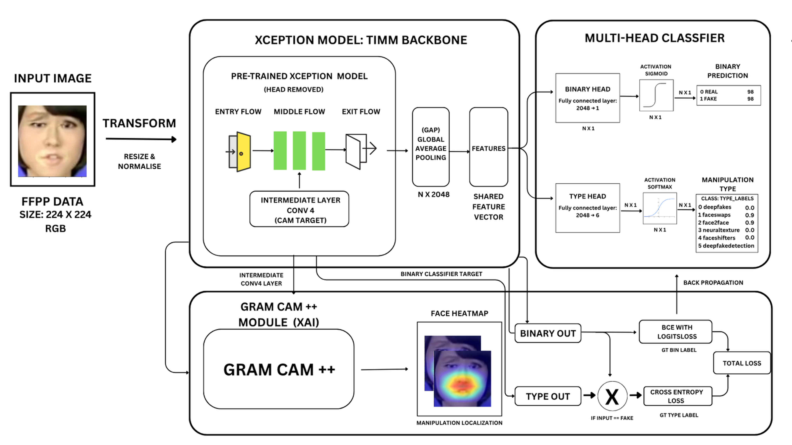
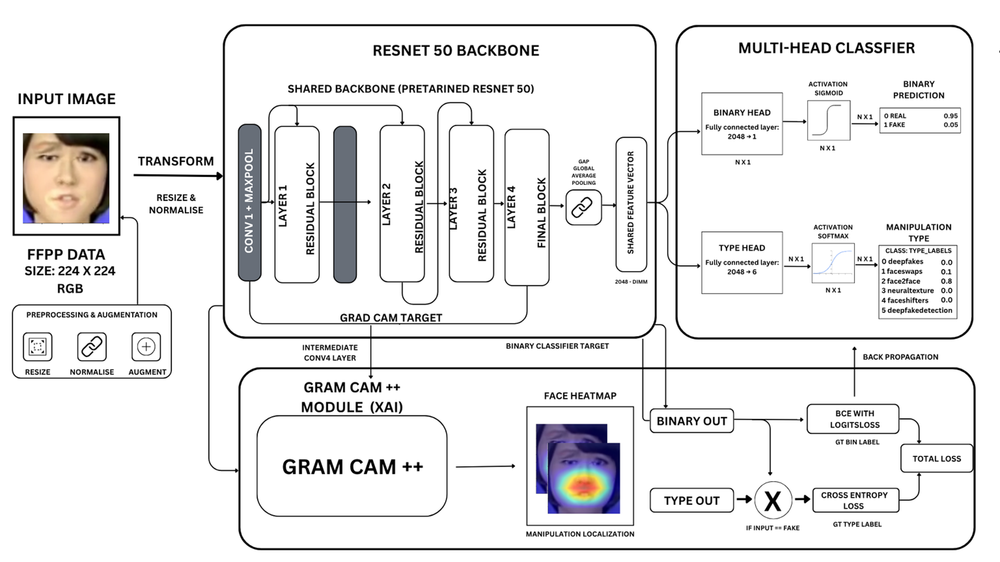
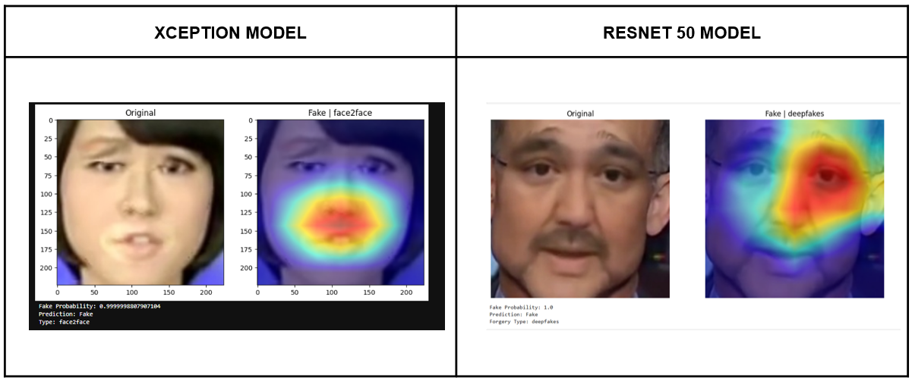

# DeepLens: Interpretable Deepfake Detection

## Overview

DeepLens is an AI-powered deepfake detection framework designed to identify manipulated facial media while providing visual explanations of forged regions.

The project combines deep learning architectures with explainable AI techniques to improve trust, transparency, and robustness in deepfake detection.

---

## Key Features

* Binary Deepfake Detection (Real vs Fake)
* Manipulation Type Classification
* Explainable AI using Grad-CAM++
* Multi-Task Learning Framework
* FaceForensics++ Dataset
* Xception and ResNet50 Architectures

---

## Dataset

**Dataset:** FaceForensics++

Classes:

* Original
* DeepFakes
* FaceSwap
* Face2Face
* NeuralTextures
* FaceShifter
* DeepFakeDetection

Images were preprocessed and resized to 224×224 resolution before training.

---

## Model Architectures

### Xception Workflow

### ResNet50 Workflow

---

## Performance Results

### Performance Summary

| Model    | Train Accuracy | Validation Accuracy |
| -------- | -------------- | ------------------- |
| Xception | 96.24%         | 94.51%              |
| ResNet50 | 98.26%         | 95.52%              |

---

## Explainability using Grad-CAM++

Grad-CAM++ visualizations help identify manipulated facial regions and provide transparency in model predictions.

---

## Research Paper

📄 Full Paper:

[Deepfake Detection Research Paper](paper/deepfake%20detection.pdf)

---

## Tech Stack

* Python
* PyTorch
* timm
* OpenCV
* NumPy
* Grad-CAM++
* FaceForensics++

---

## Authors

* Ritik Rupam Nanda
* Jnanaranjan Pati
* Palash Sinha

Department of Computer Science and Engineering
